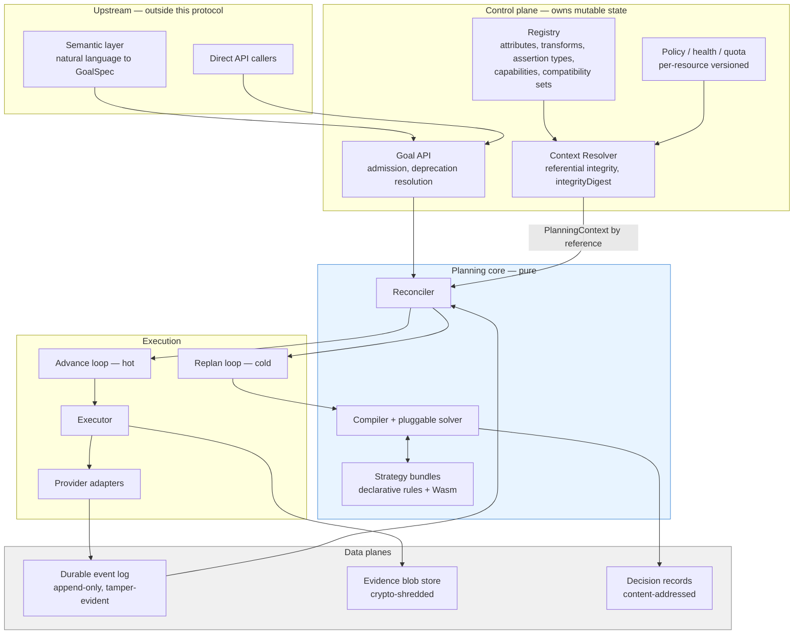
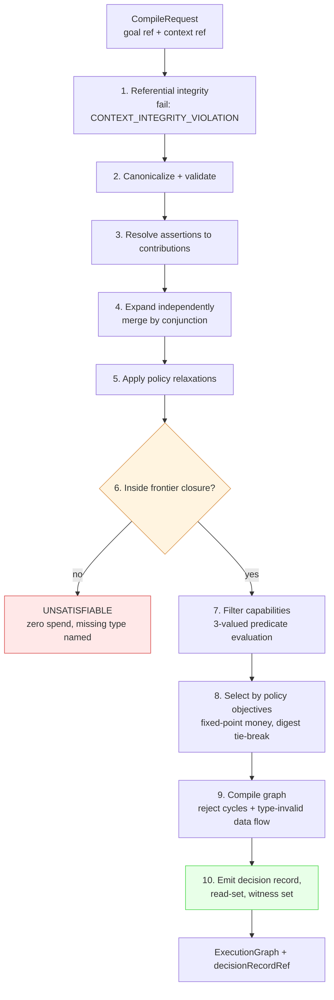
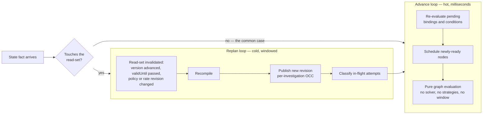
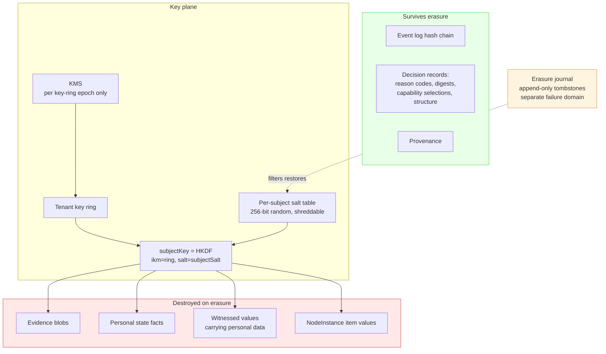
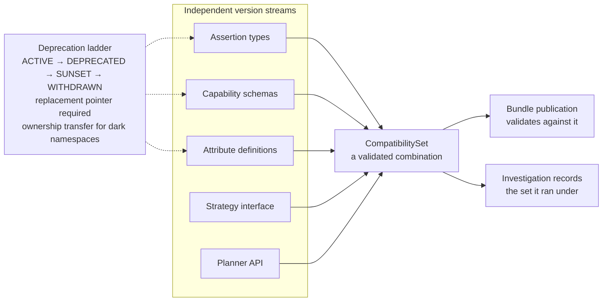
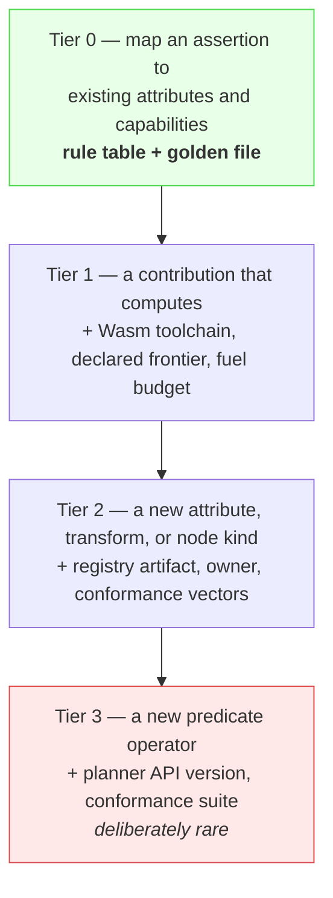

# Architecture

Diagrams for [RFC-0001](rfcs/RFC-0001-deterministic-evidence-planner.md). The RFC is normative; where this document and the RFC disagree, the RFC wins.

---

## 1. System context

The load-bearing structural decision: **the compiler never queries the control plane.** It is a pure function of a recorded context, which is what makes every decision it produces auditable.

Note the absent arrow: nothing runs from the control plane *into* the compiler at compile time. Everything it needs was resolved into `PlanningContext` first, and recorded.

---

## 2. Compilation pipeline

Ten steps, §8. Step 6 is the one that saves money: static infeasibility is proven against the bundle's production frontier **before any budget is spent**, so an impossible goal fails in milliseconds rather than after thirty minutes and forty dollars.

**Merge is a semilattice** (§9.3): union of requirements keyed by content-derived uid, constraint sets unioned. Idempotent, commutative, associative — so contribution order does not exist as a concept, and there is nothing for contributors to compete over. Two contributions that conflict produce a diagnosable unsatisfiable set naming both digests, not a silent last-writer-wins.

---

## 3. Reconciliation: two loops

A sequential chain of ten nodes under a single windowed loop pays the window ten times for zero planning work. Splitting readiness advancement from recompilation is what makes an N-hop chain independent of the reconciliation window (AC-14).

Read-set invalidation replaces hand-written relevance rules. A revision is stale **iff** a resource in its read-set advanced or expired — sound by construction, rather than by enumerating four cases correctly. A missed case there meant an investigation stalled forever with no alarm, which is the worst failure mode in the system: an idle investigation looks exactly like a healthy waiting one.

---

## 4. Attempt lifecycle across revision boundaries

The subtlest correctness problem in the design (§11.7). A node is dispatched under revision *N*; while the provider call is outstanding, revision *N+1* publishes. Serializing the event queue does not help — an HTTP request already at a third party is not inside our event loop, and no ordering discipline recalls it.

```mermaid
stateDiagram-v2
    [*] --> Intent: "append NodeAttemptIntent"
    Intent --> InFlight: "invoke provider with key"
    InFlight --> Outcome: "append NodeAttemptOutcome"
    Outcome --> [*]

    InFlight --> Classify: "revision N+1 publishes"
    Classify --> CARRIED: "same node + itemOrdinal<br/>+ idempotencyDigest"
    Classify --> ORPHANED: "node absent, or<br/>projection changed"

    CARRIED --> Outcome: "no re-dispatch;<br/>outcome applies to N+1"
    ORPHANED --> Recorded: "cost-accounted,<br/>INADMISSIBLE as evidence"
    Recorded --> [*]

    note right of CARRIED
        Safe because the idempotency key
        excludes revision by design
    end note

    note right of ORPHANED
        The effect happened and the money
        was spent — an audit log that omits
        it is false. But it cannot satisfy a
        node in the new revision.
    end note
```

Nodes whose capability declares `idempotencySupport: NONE` are **`QUIESCED`** instead: dispatch is withheld while a replan is pending for that node. Without keys there is no way to make a duplicate harmless after the fact, so the only remedy is not to create one. Quiescence is scoped to those nodes, not to the investigation and not to the hot path.

---

## 5. Data planes and the erasure boundary

Immutability and erasure are in direct conflict, and the conflict does not resolve itself. Crypto-shredding buys tamper-evidence **plus** erasure; it does not buy erasure plus recomputation, and no design does.

**The random salt is the whole property.** Deriving subject keys deterministically from the tenant key would cut KMS cost identically and silently void erasure — anyone holding the ring could re-derive any "erased" subject's key, so nothing unrecoverable was ever destroyed. The salt is the unrecoverable secret. It does not show up in any test that omits an adversary with the master key (AC-28).

---

## 6. Registry artifacts and version streams

Five streams evolve independently because they have different owners. `CompatibilitySet` does not create them; it makes existing skew checkable at publication instead of discoverable in production two years later.

---

## 7. Contributor cost ladder

The complexity a contributor meets is proportional to what they introduce. This is a design constraint, not documentation (§9.6).

Nothing above tier 0 sits on the path of a contributor who is not introducing new vocabulary. Target: a passing strategy in under fifteen minutes, with no control-plane access.
